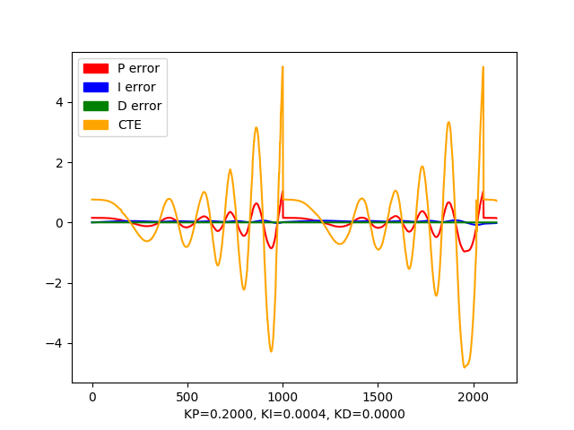
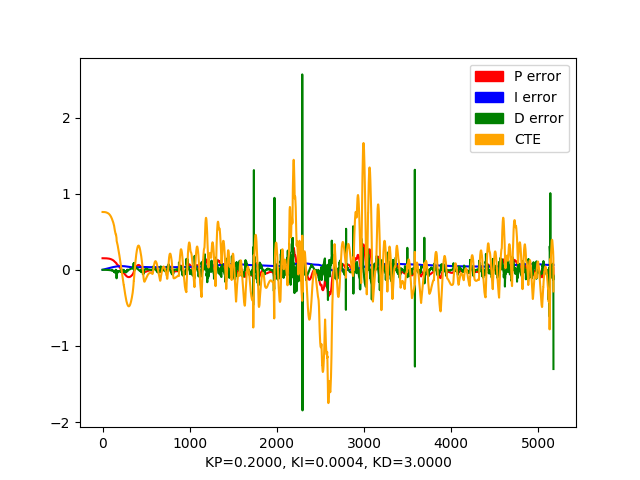
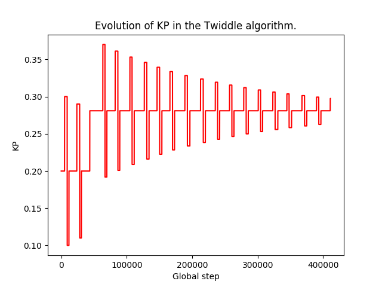
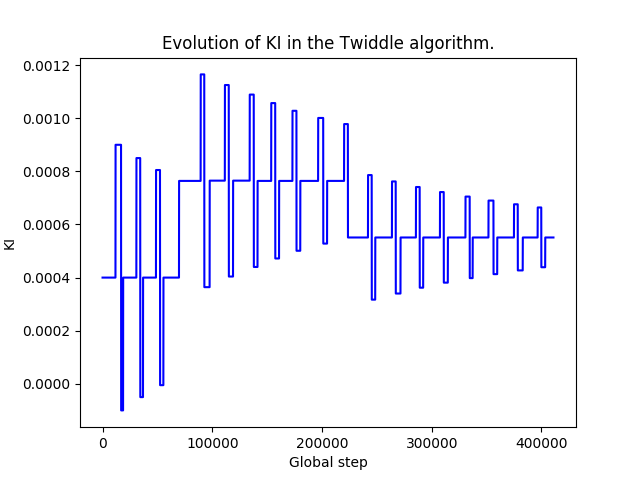
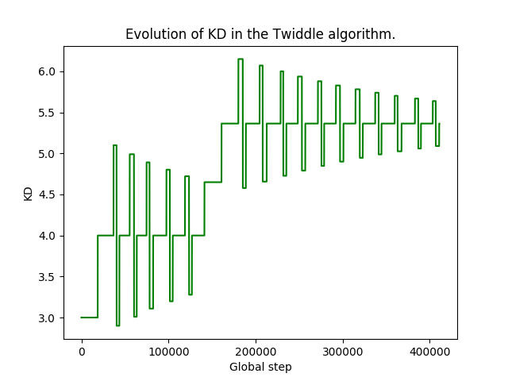
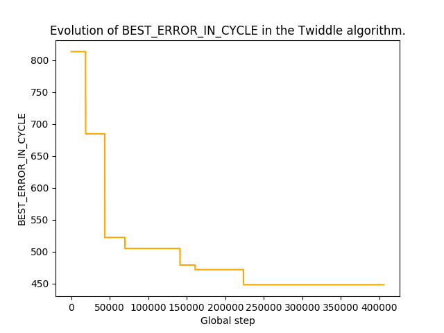

# CarND-Controls-PID (Project Write-Up)

## Reflection Item #1
*Describe the effect each of the P, I, D components had in your implementation.*

In order to analyze the effects of the three components I ran three sets of simulations: P only, P+I, and P+I+D. Since there is some non-determinism in the simulator, I ran each set 3 times. The `run_simulation.sh` bash can be used to automate the runs (the simulator must be started and stopped manually, since there is no obvious way to script its usage). The `data` folder contains the outputs of the 9 runs: each run outputs a text file with a dump of the internal state at each step, and a Python plot produced by running `process_pid_debug.py` on the text file. Since the runs were mostly consistent despite non-determinism, I'll include a single run for each parameter set in this report.

### P Component
As visible in the `run_simulation.sh` script, the coefficients for this set of runs are `Kp = 0.2, Ki = 0.0, Kd = 0.0`. I chose `Kp = 0.2` because that was the value suggested in the course. The 3 runs consistently show the `CTE` and `P error` values increasing indefinitely, making the car swerve more and more. The plot below corresponds to the first run. Around step `1000` you can see the errors getting reset. That's because I'm restarting the simulator whenever `CTE` reaches `5` (which roughly corresponds to the car getting off the road).


### PI Components
As visible in the `run_simulation.sh` script, the coefficients for this set of runs are `Kp = 0.2, Ki = 0.0004, Kd = 0.0`. Initially, I set `Ki = 0.004` as suggested in the course, but the car quickly gets off the round (after ~500 steps). With a 10x lower value, the car remains on the road longer (~1000 steps), comparable to the P-only simulation. The I component seems to do more harm than good, which might mean that parameter tuning is necessary in order to turn it into a helpful term.



### PID Components
As visible in the `run_simulation.sh` script, the coefficients for this set of runs are `Kp = 0.2, Ki = 0.0004, Kd = 3.0`. I chose `Kd = 3.0` because that was the value suggested in the course. With the addition of the D component, the car consistently finishes a full lap across the 3 runs. The plot below shows the evolution of the errors during the first run. It's interesting to see how the absolute `CTE` error does go up especially around sharp curves due to the `D` component, but then soon recovers (without the simulator being reset). Consequently, the car does swerve more than desirable, but never leaves the track.



## Reflection Item #2
*Describe how the final hyperparameters were chosen.*

As mentioned above, the PID controller with coefficients set to `Kp = 2.0, Ki = 0.0004, Kd = 3.0` yields satisfactory performance: the car doesn't leave the track, but still swerves more than desirable.

In order to tune these hyperparameters, I used the Twiddle algorithm presented in the course, with small tweaks. Its implementation is in the `PIDWrapper` class which, not surprisingly, wraps the `PID` controller and periodically updates the hyperparameters. The algorithm proceeds in cycles. One cycle consists of `num_noneval_steps` in which the CTE error is accummulated and `num_eval_steps` in which a new set of hyperparameters is evaluated. Evaluation is short-circuited whenever the accummulated error is already worse than the best error. In order to deal with the cases in which the car gets off-track, I reset the simulator and the internal state of the controller (but not the hyperparameters!) when `CTE >= 5`.

In order to run the twiddle algorithm, I started the server with the following command:
```
./pid 0.2 0.0004 3.0 twiddle 100 5000 0.2
```
This sets the initial values of the hyperparameters as discussed above, `num_noneval_steps=100`, `num_eval_steps=5000` (which roughly corresponds to one lap) and `stop_criterium=0.2`. The simulation ran for ~400K steps before converging to the following values: `Kp = 0.281000, Ki = 0.00051, Kd = 5.364032`. The best error (computed as the sum of `CTE` squares over `5000` evaluation steps) decreased from `813` down to `447`. The plots below show the evolution of the coefficients and best error.






I am doubtful that the values my run converged to are optimal. The car is still swerving sometimes, so there is definitely room for improvement. I suspect the Twiddle algorithm is very sensitive to its own hyperparameters (initial coefficient values, number of evaluation steps, initial `dp` values).

