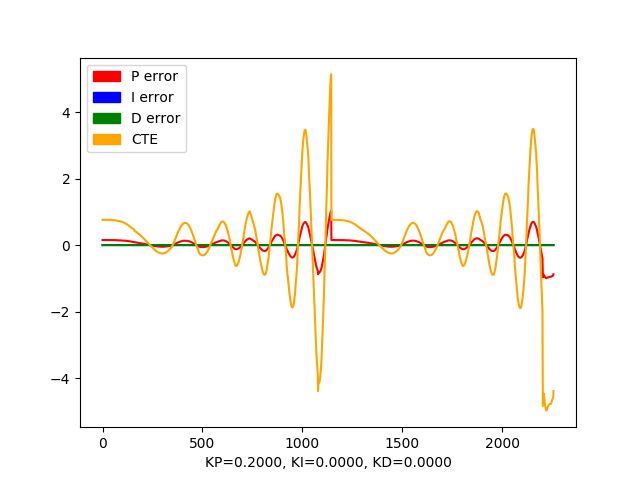

# CarND-Controls-PID (Project Write-Up)

## Reflection Item #1
*Describe the effect each of the P, I, D components had in your implementation.*

In order to analyze the effects of the three components I ran three sets of simulations: P only, P+I, and P+I+D. Since there is some non-determinism in the simulator, I ran each set 3 times. The `run_simulation.sh` bash can be used to automate the runs (the simulator must be started and stopped manually, since there is no obvious way to script its usage). The `data` folder contains the outputs of the 9 runs: each run outputs a text file with a dump of the internal state at each step, and a Python plot produced by running `process_pid_debug.py` on the text file. Since the runs were mostly consistent despite non-determinism, I'll include a single run for each parameter set in this report.

### P Component
As visible in the `run_simulation.sh` script, the coefficients for this set of runs are `Kp = 0.2, Ki = 0.0, Kd = 0.0`. I chose `Kp = 0.2` because that was the value suggested in the course. The 3 runs consistently show the `CTE` and `P error` values increasing indefinitely, making the car swerve more and more. The plot below corresponds to the first run. Around step `1000` you can see the errors getting reset. That's because I'm restarting the simulator whenever `CTE` reaches `5` (which roughly corresponds to the car getting off the road).

